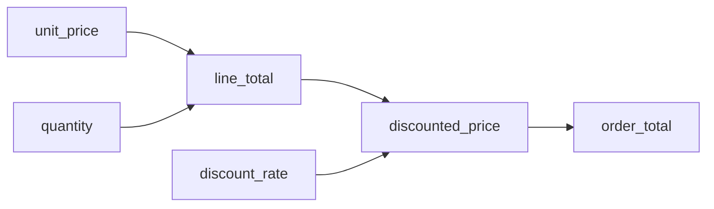
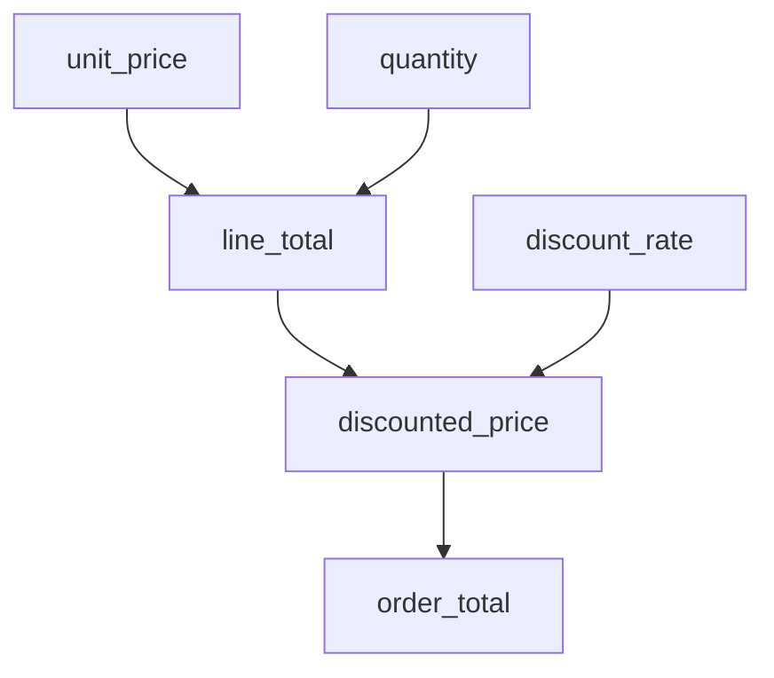

# 字段计算优先级确定机制详解

让我们通过一个最简单的例子，一步步说明如何根据字段间的引用关系确定计算优先级：

## 场景：电商订单金额计算

### 字段定义
1. **基础字段**（直接输入值）：
   - `unit_price`：商品单价
   - `quantity`：购买数量
   - `discount_rate`：折扣率

2. **计算字段**：
   - `line_total`：商品总价
   - `discounted_price`：折扣后价格
   - `order_total`：订单总额

### 字段间关系


## 拓扑排序算法执行过程详解

### 算法输入数据结构

**1. 邻接表（Adjacency List）**：
```javascript
const graph = {
  "unit_price": ["line_total"],
  "quantity": ["line_total"], 
  "discount_rate": ["discounted_price"],
  "line_total": ["discounted_price"],
  "discounted_price": ["order_total"],
  "order_total": []
};
```

**2. 入度表（In-degree Table）**：
```javascript
const inDegree = {
  "unit_price": 0,      // 无依赖
  "quantity": 0,        // 无依赖
  "discount_rate": 0,   // 无依赖
  "line_total": 2,      // 依赖unit_price和quantity
  "discounted_price": 2, // 依赖line_total和discount_rate
  "order_total": 1      // 依赖discounted_price
};
```

### 算法执行步骤

**初始状态**：
- 队列：`[]`
- 结果：`[]`
- 入度表：`{unit_price: 0, quantity: 0, discount_rate: 0, line_total: 2, discounted_price: 2, order_total: 1}`

**第1轮迭代**：
1. **找入度为0的节点**：`unit_price`, `quantity`, `discount_rate`
2. **加入队列**：`[unit_price, quantity, discount_rate]`
3. **处理unit_price**：
   - 加入结果：`[unit_price]`
   - 更新line_total入度：`2 → 1`
4. **处理quantity**：
   - 加入结果：`[unit_price, quantity]`
   - 更新line_total入度：`1 → 0`
5. **处理discount_rate**：
   - 加入结果：`[unit_price, quantity, discount_rate]`
   - 更新discounted_price入度：`2 → 1`

**第1轮结束状态**：
- 队列：`[line_total]`（line_total入度变为0）
- 结果：`[unit_price, quantity, discount_rate]`
- 入度表：`{line_total: 0, discounted_price: 1, order_total: 1}`

**第2轮迭代**：
1. **处理line_total**：
   - 加入结果：`[unit_price, quantity, discount_rate, line_total]`
   - 更新discounted_price入度：`1 → 0`

**第2轮结束状态**：
- 队列：`[discounted_price]`
- 结果：`[unit_price, quantity, discount_rate, line_total]`
- 入度表：`{discounted_price: 0, order_total: 1}`

**第3轮迭代**：
1. **处理discounted_price**：
   - 加入结果：`[unit_price, quantity, discount_rate, line_total, discounted_price]`
   - 更新order_total入度：`1 → 0`

**第3轮结束状态**：
- 队列：`[order_total]`
- 结果：`[unit_price, quantity, discount_rate, line_total, discounted_price]`
- 入度表：`{order_total: 0}`

**第4轮迭代**：
1. **处理order_total**：
   - 加入结果：`[unit_price, quantity, discount_rate, line_total, discounted_price, order_total]`

**最终结果**：
- 计算顺序：`[unit_price, quantity, discount_rate, line_total, discounted_price, order_total]`
- 所有节点都已处理，无循环依赖

### 分层结果分析

根据算法执行过程，我们可以得到分层结构：

**第0层（同时可计算）**：
- `unit_price`, `quantity`, `discount_rate`

**第1层**：
- `line_total`（等待第0层完成）

**第2层**：
- `discounted_price`（等待第1层完成）

**第3层**：
- `order_total`（等待第2层完成）

## 确定计算优先级的步骤

### 第一步：收集所有字段的依赖声明

| 字段 | 公式 | 声明的依赖 |
|------|------|------------|
| `line_total` | `unit_price * quantity` | `unit_price`, `quantity` |
| `discounted_price` | `line_total * (1 - discount_rate)` | `line_total`, `discount_rate` |
| `order_total` | `discounted_price` | `discounted_price` |

### 第二步：构建依赖关系图



### 第三步：确定计算层级

1. **第0层：基础字段**（无依赖）
   - `unit_price`
   - `quantity`
   - `discount_rate`

2. **第1层：直接依赖基础字段**
   - `line_total`（依赖`unit_price`和`quantity`）

3. **第2层：依赖第1层结果**
   - `discounted_price`（依赖`line_total`和`discount_rate`）

4. **第3层：依赖第2层结果**
   - `order_total`（依赖`discounted_price`）

### 第四步：生成计算顺序

1. 首先计算所有**第0层**字段（基础字段，无需计算）
2. 然后计算**第1层**字段：`line_total`
3. 接着计算**第2层**字段：`discounted_price`
4. 最后计算**第3层**字段：`order_total`

## 复杂场景：多分支依赖的算法执行

让我们看一个更复杂的例子，展示算法如何处理多分支依赖：

### 场景：财务报表计算

**字段定义**：
```javascript
const complexGraph = {
  "revenue": ["gross_profit", "profit_margin"],
  "cost": ["gross_profit"],
  "gross_profit": ["net_profit", "profit_margin"],
  "expenses": ["net_profit"],
  "net_profit": [],
  "profit_margin": []
};

const complexInDegree = {
  "revenue": 0,
  "cost": 0, 
  "expenses": 0,
  "gross_profit": 2,    // 依赖revenue和cost
  "net_profit": 2,      // 依赖gross_profit和expenses
  "profit_margin": 2    // 依赖revenue和gross_profit
};
```

**算法执行过程**：

**第1轮**：处理入度为0的节点
- 队列：`[revenue, cost, expenses]`
- 结果：`[revenue, cost, expenses]`
- 更新后入度：`{gross_profit: 0, net_profit: 1, profit_margin: 1}`

**第2轮**：处理gross_profit
- 队列：`[gross_profit]`
- 结果：`[revenue, cost, expenses, gross_profit]`
- 更新后入度：`{net_profit: 0, profit_margin: 0}`

**第3轮**：处理net_profit和profit_margin（可并行）
- 队列：`[net_profit, profit_margin]`
- 结果：`[revenue, cost, expenses, gross_profit, net_profit, profit_margin]`

**分层结果**：
- 第0层：`[revenue, cost, expenses]`（可并行）
- 第1层：`[gross_profit]`
- 第2层：`[net_profit, profit_margin]`（可并行）

## 实际计算过程示例

### 输入数据：
- `unit_price` = 100
- `quantity` = 2
- `discount_rate` = 0.1（10%折扣）

### 计算步骤：

1. **第0层字段准备**（基础值）：
   - `unit_price` = 100（已就绪）
   - `quantity` = 2（已就绪）
   - `discount_rate` = 0.1（已就绪）

2. **第1层计算**（`line_total`）：
   - 依赖字段：`unit_price`和`quantity`都已就绪
   - 计算：100 × 2 = 200
   - 结果：`line_total` = 200

3. **第2层计算**（`discounted_price`）：
   - 依赖字段：`line_total`（200）和`discount_rate`（0.1）都已计算完成
   - 计算：200 × (1 - 0.1) = 180
   - 结果：`discounted_price` = 180

4. **第3层计算**（`order_total`）：
   - 依赖字段：`discounted_price`（180）已计算完成
   - 计算：直接使用`discounted_price`的值
   - 结果：`order_total` = 180

## 复杂场景：循环依赖处理

### 新增字段：
- `final_price`：最终价格
- `service_fee`：服务费（基于最终价格）

```mermaid
graph TD
    discounted_price --> final_price
    final_price --> service_fee
    service_fee --> final_price  // 循环依赖！
```

### 系统处理流程：
1. **检测循环依赖**：
   - `final_price` → `service_fee` → `final_price`
   - 系统立即识别出循环链

2. **错误处理**：
   - 抛出明确错误："检测到循环依赖：final_price → service_fee → final_price"
   - 建议解决方案：
     - 修改`service_fee`的计算公式，不再依赖`final_price`
     - 为`service_fee`设置默认值

3. **自动恢复尝试**（可选配置）：
   - 设置最大迭代次数（如3次）
   - 使用上一次计算的值作为初始值
   - 迭代计算直到结果收敛

## 虚拟列的特殊处理

### 场景：计算平均价格
```json
{
  "field": "avg_price",
  "formula": "SUM(items.price * items.quantity) / SUM(items.quantity)",
  "dependencies": ["items.price", "items.quantity"]
}
```

### 系统处理：
1. **识别虚拟列**：
   - `SUM(items.price * items.quantity)` → 临时虚拟列`total_amount`
   - `SUM(items.quantity)` → 临时虚拟列`total_quantity`

2. **计算顺序**：
   - 先计算`total_amount`（依赖`items.price`和`items.quantity`）
   - 再计算`total_quantity`（依赖`items.quantity`）
   - 最后计算`avg_price` = `total_amount / total_quantity`

3. **资源管理**：
   - 计算完成后立即销毁`total_amount`和`total_quantity`

## 关键原则总结

1. **依赖先行原则**：被依赖的字段总是优先计算
2. **层级递进原则**：从基础字段开始，逐层向上计算
3. **自动排序机制**：系统自动确定最优计算顺序
4. **循环阻断机制**：实时检测并处理循环依赖
5. **虚拟列透明化**：临时列的计算对用户不可见

通过这种基于依赖关系的优先级确定机制，系统能够智能地安排计算顺序，确保每个字段都在其依赖字段计算完成后才开始计算，从而保证计算结果的准确性和一致性。